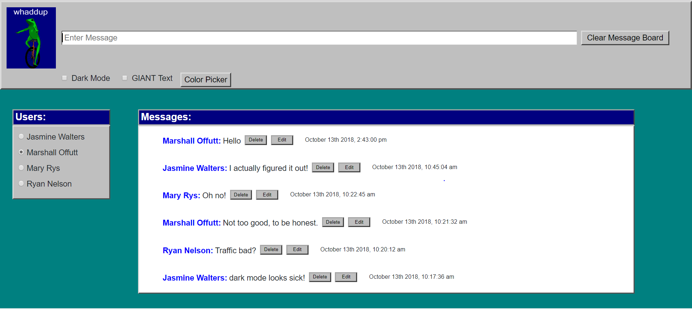

# Chatty by Bottle Openers

### Description 
>Chatty is a messaging app with attitude.
>Users must select their name in order to post content.
>All messages are logged, and can be edited or deleted as necessary.
>The app can also be heavily personalized to the user's liking. Background colors, text colors, and even a dark mode is available at the click of a button.

### Technology Used
> * HTML5
> * CSS
> * Javascript
> * Bootstrap 4

### Screenshot

Full website of Chatty app.

### How to Run 
```
1. Go to: `https://www.npmjs.com/package/http-server` and install "http-server".  
2. Navigate to the project folder in command line interface and type: `http-server -p 8080`  
3. This will show at: `http://localhost:8080` in your internet browser.  
```

### Contributors:
[Jasmine Walters](https://github.com/jsmnwltrs)<br>
[Marshall Offutt](https://github.com/moffutt10)
<br>
[Ryan Nelson](https://github.com/dragonxrage88)
<br>
[Mary Rys](https://github.com/MaryRys)
